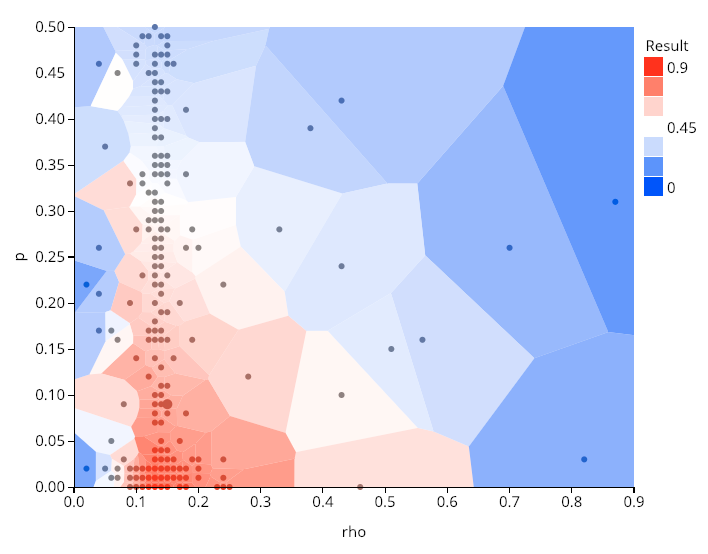

# Global optimization using Differential Evolution algorithm

A script for global optimization problem using the differential evolution algorithm.
It finds a ParameterSet which gives the minimum (or maximum) of the simulation result via iterated simulations.

Differential evolution is a stochastic population based method that is useful for global optimization problems.
For the details of the differential evolution, please see [Wikipedia](https://en.wikipedia.org/wiki/Differential_evolution).

In this sample, we used DE for a traffic simulation model [Nagel-Schereckenberg model](https://en.wikipedia.org/wiki/Nagel%E2%80%93Schreckenberg_model), which is based on cellular automata.
We will find a set of parameters which maximizes the amount of traffic flow. The domains of the parameters are

- v : maximum velocity (3~7)
- p : deceleration probability (0~0.5)
- rho : density of the vehicles (0.01~0.9)

Although we use it for the NS model in this sample, the code is readily applicable to other simulators.

We are going to use the DE algorithm implemented in `scipy.optimize.differential_evolution` module.
See the [reference](https://docs.scipy.org/doc/scipy/reference/generated/scipy.optimize.differential_evolution.html) of this package for details.

## Prerequisite

`scipy` (>=1.2.0) package is used for DE algorithm.

```
$ pip install scipy
```

Pipenv users may use the following instead.

```
$ pipenv install
```

## Usage

First, register a sample simulator used in this sample. We are going to use this simulator.
https://github.com/yohm/sim_ns_model
Follow the instruction to register the model on OACIS.

You'll find "NS_model" simulator on your OACIS.
This sample simulator has several input parameters, l, v, rho, p, ....

In our setting, l = 200, t_init=500, t_measure=10000 are fixed while the other parameters are subject to change.
To find a solution which maximizes the flow, run the script as the following.

```
$ <oacis_path>/bin/oacis_python de_optimize.py 2> log
```

An example of output is the following.
It typically takes several minutes to complete one generation. (It depends on the "Max # of Jobs" of the host.) It may take a few hours until the whole process get completed.

```
differential_evolution step 1: f(x)= -0.648787
differential_evolution step 2: f(x)= -0.708922
differential_evolution step 3: f(x)= -0.708922
differential_evolution step 4: f(x)= -0.712406
differential_evolution step 5: f(x)= -0.797589
differential_evolution step 6: f(x)= -0.81
differential_evolution step 7: f(x)= -0.818581
differential_evolution step 8: f(x)= -0.834587
differential_evolution step 9: f(x)= -0.834587
differential_evolution step 10: f(x)= -0.834587
differential_evolution step 11: f(x)= -0.834587
differential_evolution step 12: f(x)= -0.84
differential_evolution step 13: f(x)= -0.84
differential_evolution step 14: f(x)= -0.844721
differential_evolution step 15: f(x)= -0.86
differential_evolution step 16: f(x)= -0.86
differential_evolution step 17: f(x)= -0.86
differential_evolution step 18: f(x)= -0.87
differential_evolution step 19: f(x)= -0.87
{'fun': -0.8699999999999573,
 'message': 'Optimization terminated successfully.',
 'nfev': 904,
 'nit': 19,
 'success': True,
 'x': array([6.68806649e+00, 1.34852006e-01, 2.76609603e-05])}
```

Therefore, the optimal parameters found by the DE algorithm is `l = 7`, `rho=0.13` and `p=0`.

It iteratively creates ParameterSets and Runs. When the evaluation of a ParameterSet is complete, populations in the next generations are created.

You'll find something like the following if you make a heatmap of flow as a function of rho and p.



## Author

@yohm

