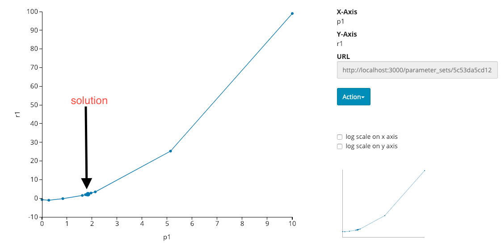

# Title

A script for automated parameter tuning. It finds a parameter which gives the expected result via iterated trials.

In this script, a parameter to be tuned is a single scalar value (Float or Integer) and the output is also a single scalar Float value.
To find a solution, `scipy.optimize.brentq` method is used in this sample though you may use other root finding algorithms in a similar way.

https://docs.scipy.org/doc/scipy/reference/generated/scipy.optimize.brentq.html#scipy.optimize.brentq

## Prerequisite

scipy is necessary to run this sample.

```
$ pip install scipy
```

Pipenv users may use the following instead.

```
$ pipenv install
```

## Usage

First, register a sample simulator used in this sample.

```
$ <oacis_path>/bin/oacis_python register_sample_sim.py
```

You'll find "root_find_sample" simulator on your OACIS.
This sample simulator has two input parameters "p1" and "p2", and returns one output "r1".
All these parameters are Float.

In our setting, "p2" is fixed to 0 while "p1" change between 0 and 10. We are going to find "p1" that yields `r1 == 2`.
To find a solution, run the script for root finding.

```
$ <oacis_path>/bin/oacis_python root_find.py
```

An example of output is the following.

```
$ ~/work/oacis/bin/oacis_python root_find.py
2019-02-01 14:15:27,045 - oacis.oacis_watcher - INFO - start polling
2019-02-01 14:15:27,054 - oacis.oacis_watcher - INFO - calling callback for 5c53d079d12ac67d5badcd87
2019-02-01 14:15:27,082 - oacis.oacis_watcher - INFO - calling callback for 5c53d083d12ac67d5badcd89
2019-02-01 14:15:27,153 - oacis.oacis_watcher - INFO - waiting for 5 sec
2019-02-01 14:15:32,164 - oacis.oacis_watcher - INFO - waiting for 5 sec
2019-02-01 14:15:37,173 - oacis.oacis_watcher - INFO - calling callback for 5c53d5efd12ac6042bf17627
2019-02-01 14:15:37,212 - oacis.oacis_watcher - INFO - waiting for 5 sec
2019-02-01 14:15:42,222 - oacis.oacis_watcher - INFO - waiting for 5 sec
2019-02-01 14:15:47,233 - oacis.oacis_watcher - INFO - calling callback for 5c53d5f9d12ac6042bf17629
2019-02-01 14:15:47,270 - oacis.oacis_watcher - INFO - waiting for 5 sec
2019-02-01 14:15:52,280 - oacis.oacis_watcher - INFO - waiting for 5 sec
2019-02-01 14:15:57,291 - oacis.oacis_watcher - INFO - calling callback for 5c53d603d12ac6042bf1762b
2019-02-01 14:15:57,335 - oacis.oacis_watcher - INFO - waiting for 5 sec
2019-02-01 14:16:02,343 - oacis.oacis_watcher - INFO - waiting for 5 sec
2019-02-01 14:16:07,351 - oacis.oacis_watcher - INFO - calling callback for 5c53d60dd12ac6042bf1762d
2019-02-01 14:16:07,397 - oacis.oacis_watcher - INFO - waiting for 5 sec
2019-02-01 14:16:12,408 - oacis.oacis_watcher - INFO - calling callback for 5c53d617d12ac6042bf1762f
2019-02-01 14:16:12,446 - oacis.oacis_watcher - INFO - waiting for 5 sec
2019-02-01 14:16:17,453 - oacis.oacis_watcher - INFO - calling callback for 5c53d61cd12ac6042bf17631
2019-02-01 14:16:17,493 - oacis.oacis_watcher - INFO - waiting for 5 sec
2019-02-01 14:16:22,502 - oacis.oacis_watcher - INFO - calling callback for 5c53d621d12ac6042bf17633
(1.7741906871037223,       converged: True
           flag: 'converged'
 function_calls: 9
     iterations: 8
           root: 1.7741906871037223)
2019-02-01 14:16:22,524 - oacis.oacis_watcher - INFO - stop polling. (interrupted=False)
```

It iteratively creates ParameterSets and Runs. When the evaluation of a ParameterSet is complete, `brentq` method selects the next candidate of "p1".

You'll find something like the following if you make a plot of r1 as a function of p1.



## Author

@yohm

